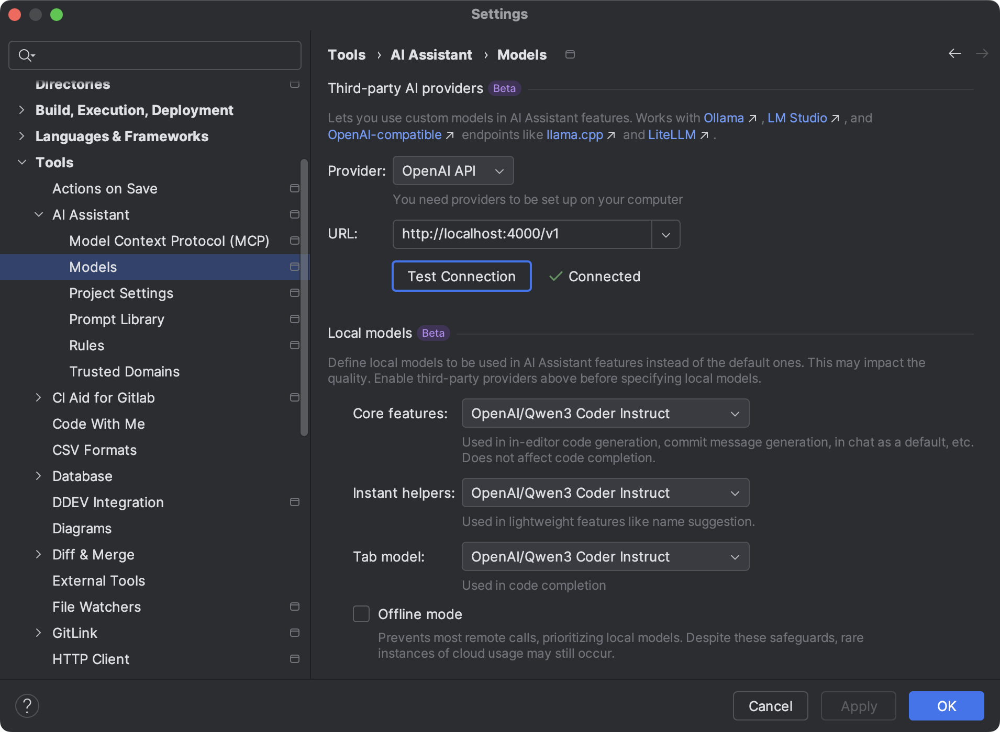

# mittwald LLM Proxy

Setup a proxy with [LiteLLM](https://litellm.ai/) to use the [mittwald AI hosting](https://www.mittwald.de/mstudio/ai-hosting) in your IDE. This proxy allows you to integrate mittwald's GDPR-compliant AI models hosted in German data centers into your development workflow.

## About mittwald AI Hosting

mittwald AI hosting provides access to powerful AI models while ensuring data protection and compliance with GDPR. All models are hosted exclusively in German data centers, ensuring no US data transfer and no storage of user inputs.

### Available Models

- **Mistral-Small-3.2-24B-Instruct**: European open-source model, reliable for versatile text and chat tasks
- **Qwen3-Embedding-8B**: Efficient open-source embedding model for search, recommendations, and data integration
- **Qwen3-Coder-30B-Instruct**: Specialized in code generation and debugging

### Key Features

- ✅ GDPR-compliant AI hosting in Germany
- ✅ No US data transfer
- ✅ No storage of user inputs
- ✅ 300 requests/minute per API key (subject to change after Beta phase)
- ✅ Currently free during beta phase
- ✅ Easy API integration

## Quick Setup

1. **Copy the environment template**
   ```bash
   cp .env.example .env
   ```

2. **Get your API key**
   - Visit the [mittwald mStudio](https://www.mittwald.de/mstudio/ai-hosting)
   - Generate your AI hosting API key
   - See the [access documentation](https://developer.mittwald.de/docs/v2/platform/aihosting/access-and-usage/) for detailed instructions

3. **Configure your environment**
   - Edit `.env` and set your key in `MITTWALD_LLM_HOSTING_KEY`

4. **Start the proxy**
   ```bash
   docker compose up
   # or run in background
   docker compose up --detached
   ```

The proxy will be available at `http://localhost:4000/v1` and compatible with OpenAI API format.

## IDE Setup

### Jetbrains IDEs (IntelliJ, PHPStorm, Webstorm, ...)



1. Open Settings → Tools → AI Assistant → Models
2. Under **Third-party AI providers**, choose **OpenAI API** as a provider
3. Set URL to `http://localhost:4000/v1`
4. The local proxy will handle request forwarding and authentication

### Other IDEs

Most IDEs with AI assistance can be configured by:
- Setting the OpenAI API endpoint to `http://localhost:4000/v1`
- Using OpenAI-compatible authentication

## Technical Details

This proxy uses [LiteLLM](https://litellm.ai/) to provide OpenAI API compatibility with mittwald's AI hosting service. The proxy handles authenticating with the mittwald API, and routing requests to the appropriate model.

## Documentation & Resources

- 📚 [mittwald AI Hosting Documentation](https://developer.mittwald.de/docs/v2/platform/aihosting/)
- 🔐 [Access and Usage Guide](https://developer.mittwald.de/docs/v2/platform/aihosting/access-and-usage/)
- 🤖 [Available Models](https://developer.mittwald.de/docs/v2/platform/aihosting/available-models/)
- 🔗 [API Endpoints](https://developer.mittwald.de/docs/v2/platform/aihosting/api-endpoints/)
- 🌐 [Product Page](https://www.mittwald.de/mstudio/ai-hosting)

## Requirements

- Docker and Docker Compose
- mittwald AI hosting API key
- Network access to mittwald's API endpoints

## Support

For issues with:
- **This proxy**: Open an issue in this repository
- **mittwald AI hosting**: Contact [mittwald support](https://www.mittwald.de/support)
- **API access**: See the [access documentation](https://developer.mittwald.de/docs/v2/platform/aihosting/access-and-usage/)

---

*Currently in beta phase - free for agencies and developers. Expected full release in 2025.*
